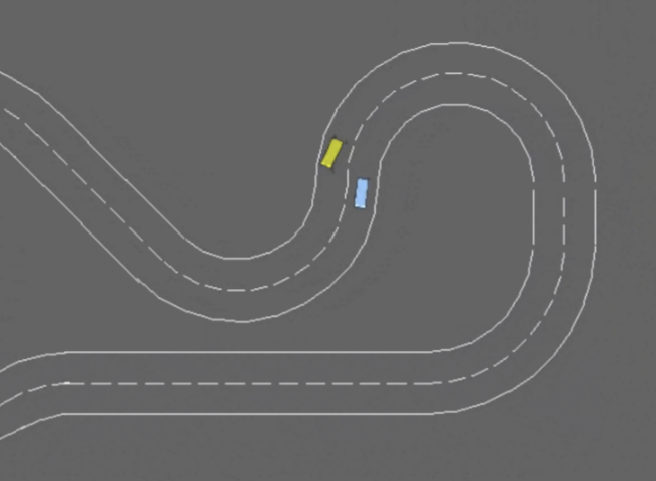
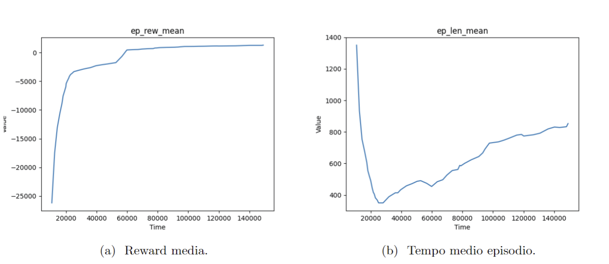

# Apprendimento con Rinforzo per la Navigazione Stradale

## Descrizione del Progetto

Il progetto nasce dalla necessità di sviluppare un agente capace di apprendere e migliorare le sue azioni attraverso il reinforcement learning. L'attenzione è stata focalizzata su un ambiente, simile a una strada, dove l'agente deve navigare mantenendosi nella corsia e adottare azioni ottimali per una guida sicura ed efficiente.

## Problema Specifico

Il problema specifico affrontato consiste nel guidare un veicolo in un percorso stradale. L'agente è immerso in un ambiente discreto che modella una strada a due corsie. L'obiettivo è mantenere il veicolo nella corsia, effettuare sorpassi senza collisioni e adottare azioni ottimali per mantenere una guida sicura, simulando situazioni di traffico reali. L'agente deve affrontare sfide per migliorare continuamente le proprie prestazioni.

## Scelte Progettuali

### Scelta della Libreria

Per implementare e testare il nostro agente, abbiamo scelto di utilizzare la libreria Gymnasium, una piattaforma open-source originariamente sviluppata da OpenAI ed ora mantenuta dalla Farama Foundation. Gymnasium offre un ambiente di sviluppo flessibile e potente per la creazione e la validazione di algoritmi di reinforcement learning. Abbiamo utilizzato l'ambiente racetrack della libreria di terze parti highway-env, che offre versatilità e adattabilità essenziali per lo sviluppo e il test delle nostre soluzioni.

### Descrizione dell’Ambiente

- **Agente:** Un veicolo capace di percepire l'ambiente e navigare all'interno di esso. Può compiere azioni quali accelerare, frenare e sterzare.
- **Ambiente:** Un tracciato con due corsie delimitate da linee di demarcazione, con veicoli che seguono il tracciato e possono cambiare corsia.
- **Osservazioni:** Un tensore con shape (2,12,12) che rappresenta due matrici booleane, modellando la presenza di altri veicoli e i bordi della strada in un'area 12×12 attorno all'agente.

## Soluzione Proposta

### Primo Approccio

#### Naive Q-Learning

Inizialmente, abbiamo esplorato approcci basati su Q-learning tradizionale e SARSA, ma lo spazio delle osservazioni risultava troppo ampio.

#### Diminuire lo Spazio delle Osservazioni

Abbiamo sperimentato osservazioni alternative per ridurre lo spazio, ma senza successo.

#### Value Function Approximation

Utilizzando una funzione di valore approssimata con un regressore tramite SGD, abbiamo riscontrato comportamenti indesiderati del veicolo.

### Deep Q-Learning (DQN)

Il deep Q-learning combina il reinforcement learning con l'uso di deep neural networks. Abbiamo utilizzato la libreria Stable-Baselines3 e la MlpPolicy per implementare l'algoritmo DQN.

#### Adattamento dell’Ambiente

- **Discretizzazione delle Azioni:** Conversione delle azioni continue in discrete.
- **Modifica della Funzione di Reward:** Introduzione di penalità per avvicinamenti pericolosi e uscite dal tracciato.
- **Configurazione dei Parametri:** Ottimizzazione delle configurazioni dell'ambiente per migliorare l'apprendimento.

## Addestramento e Sperimentazioni

L'addestramento è stato eseguito su 150.000 epoche con veicoli variabili in ogni episodio. Gli iperparametri scelti sono stati ottimizzati tramite vari test.

## Risultati e Considerazioni

I risultati ottenuti sono promettenti. L'agente riesce a navigare in sicurezza, evitare collisioni e superare altri veicoli. La durata media degli episodi e la reward sono migliorate significativamente rispetto agli approcci iniziali.

## Conclusioni

Il progetto ha dimostrato che l'implementazione di un agente di guida attraverso l'apprendimento con rinforzo in un ambiente complesso è possibile ed efficace. La scelta di Gymnasium e l'adozione di DQN hanno contribuito al successo del progetto, fornendo una base solida per sviluppi futuri.
